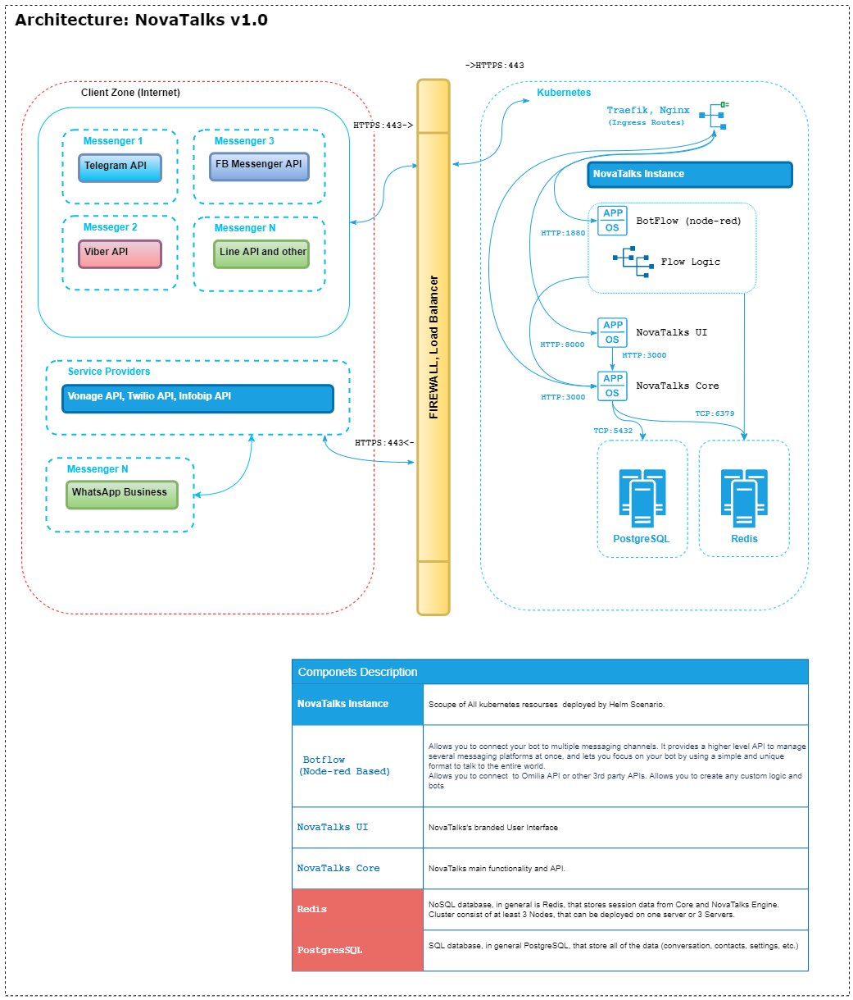

# *NovaTalks K3S Installation Guide*


## Components
  - **[Nova.BotFlow](#novabotflow)**
  - **[NovaTalks.UI](#markdown-header-novachatproxygenesyspureconnecticws)**
  - **[NovaTalks.Core](#markdown-header-novachatproxygenesyspureconnectiwt)**


### :information_source: *Nova.BotFlow*

  Component allows to connect of different Messengers through its Flows. Have a self-web  UI and Flows that are like browser-based editor that makes it easy to wire together  flows using the wide range of nodes in the palette that can be deployed to its runtime  in a single-click.
  Here, in a Flows, Main and Custom place logic for inbound, outbound messages and bot.
  Redis may be pre-installed with Botflow.

### :information_source: *NovaTalks.UI*

  The component corresponds to the solution's User Interface. Interacts with NTK.Core  and User through API Calls and WebSocket.

### :information_source: *NovaTalks.Core*

  Main solutions component. Core provides the general functionality of our Solution.  PostgreSQL and Redis must be pre-installed with the NTK.Core

## :exclamation: Prerequisites

  1. Traefik as main Ingress gateway
  2. Tuned Certmanager or wildcard public certificate
  3. Longhorn or, at least, local-path Storage class.

## :cd: Installation

  Progress of installation mainly is helm installation only.
  Before installation we must change *./values.yaml*. All parameters will be placed   intorelated kubernetes resourses.

### :white_check_mark: Step 1

  Change values.yam file  

  *Global Section*  
  Components versions :small_red_triangle_down: :
  * ver_ui
  * ver_engine
  * ver_botflow
  
  System names :small_red_triangle_down: :
  * project_name  - will automatically add prefix name to all k3s resources
  * customer_name - namespace for all components, except ingress routes
  * customer_fqdn - pulic FQDN; uses in the Ingress Gateways and Certmanager
  * db_host - internal address inside k3s; can be external
  * db_name - DB name inside k3s
  * db_user - user name inside k3s
  * redis_host - internal address inside k3s; can be external
  * redis_port - internal port inside k3s; can be external
  * storage - type of storage: longhorn or local_path
  * nodeBind - array of nodes for Affinity rules
  * sizing - for each component  
    
  *Environment variables Section*

  Further Vars must be changed, all other leave as is :small_red_triangle_down: :
  * UI_VAPID_PUBLIC_KEY - get it from DB
  * ENGINE_FRONTEND_URL - pulic FQDN base URL for an instance 
  * ENGINE_STORE_URL - pulic FQDN base URL for an instance 
  * ENGINE_SWAGGER_STATS_ENABLE - false, if high load expected
  * ENGINE_LOG_LEVEL - info, if high load expected
  * ENGINE_AUTH_JWT_SECRET - generate your own
  * ENGINE_LDAP_* - all this parameters related for you LDAP settings

### :white_check_mark: Step 2 

  Rename credentianls configs and add propper data :small_red_triangle_down: :

  ```shell
    # mv ./config/template_auth_botflow_admin ./config/auth_botflow_admin
    # mv ./config/template_auth_botflow_user ./config/auth_botflow_user
    # mv ./config/template_auth_core ./config/auth_core
    # mv ./config/template_auth_engine ./config/auth_engine
  ```

Botflow credentials hash can be obtain through console command :small_red_triangle_down: :
  ```shell
    # node-red admin hash-pw
  ```

### :white_check_mark: Step 3

Installation commands :small_red_triangle_down: :
  
  ```shell
    # cp ./ntk-chart/ ./<project_name>
    # cd ./<project_name>
    # helm install <application-name> ./
  ```

## Architecture

