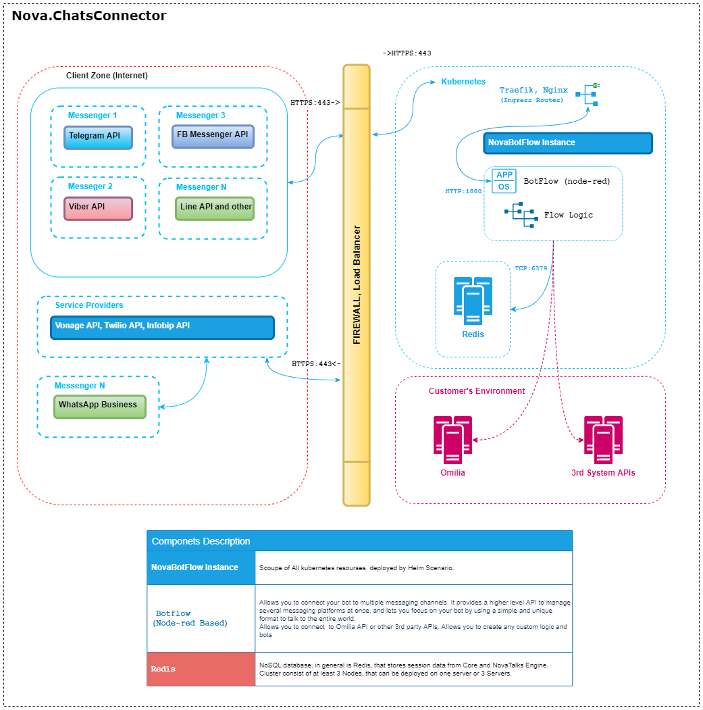

# *NovaTalks K3S Installation Guide*


## Components
  - **[Nova.BotFlow](#novabotflow)**

### :information_source: *Nova.BotFlow*

  The Solution is based on Node-Red Project. Component allows to connect of different Messengers through its Flows. Have a self-web  UI and Flows that are like browser-based editor that makes it easy to wire together  flows using the wide range of nodes in the palette that can be deployed to its runtime  in a single-click.
  Here, in a Flows, Main and Custom place logic for inbound, outbound messages and bot.
  Redis must be pre-installed with Botflow.


## :exclamation: Prerequisites

  1. Kubernetes Cluster
  2. Public certificate or wildcard public certificate (optional)
  3. Persistent Storage for ```userdata```

## :cd: HELM Installation

  Progress of installation mainly is helm installation only.
  Before installation we must change *./values.yaml*. All parameters will be placed  into related kubernetes resourses.
  Scenario of Helm installation consists of following files:
  ```
  ├── Chart.yaml
  ├── config
  │   ├── template_auth_botflow_admin
  │   └── template_auth_botflow_user
  ├── templates
  │   ├── botflow
  │   │   ├── standalone-botflow-configmap.yml
  │   │   ├── standalone-botflow-deployment.yml
  │   │   └── standalone-botflow-service.yml
  │   ├── core-standalone-cert.yml 
  │   ├── core-standalone-ingressroute.yml
  │   ├── db
  │   │   ├── core-standalone-redis-configmap.yml
  │   │   ├── core-standalone-redis-deployment.yml
  │   │   └── core-standalone-redis-service.yml
  │   ├── _resources.tpl
  │   ├── standalone-namespace.yml
  │   └── storage.yaml
  └── values.yaml 
  ```
  * Files: ```template_auth_botflow_admin```, ```template_auth_botflow_user```, ```values.yaml```  - must be modified. 
  * Files ```core-standalone-cert.yml```, ```core-standalone-ingressroute.yml``` can be delete if you don't use Traefik and Certmanager. 
  * All others are typical Kubernetes resources with related suffix in file name:

    1. Deployments add Replica Sets for Redis and Botflow.
    2. Config Maps add Configs for related Deployments
    3. Services add Network Names for Deployments.
    4. Namespace, PVC, PV
    
<div style="page-break-after: always;"></div>

### :white_check_mark: Step 1

  Change values.yam file according to your Kubernetes environment
  
  System names :small_red_triangle_down: :
  * project_name  - will automatically add prefix name to all k3s resources
  * customer_name - namespace for all components, except ingress routes
  * customer_fqdn - pulic FQDN; uses in the Ingress Gateways and Certmanager
  * storage - type of storage: longhorn or local_path
  * nodeBind - array of nodes for Affinity rules
  * sizing - for each component  

  Other Values, such as image, tag, sizing are provided by Vendor. 
    


### :white_check_mark: Step 2 

  1. Rename credentianls configs and add propper data :small_red_triangle_down: :

  ```shell
    # mv ./config/template_auth_botflow_admin ./config/auth_botflow_admin
    # mv ./config/template_auth_botflow_user ./config/auth_botflow_user

  ```

  2. Botflow credentials hash can be obtained through console command. Before using this command Node-Red  2. must be installed by self on 3rd system :small_red_triangle_down: :
  ```shell
    # node-red admin hash-pw
  ```

  For example Hash for ```password``` be the next:

  ```shell
    # node-red admin hash-pw
    Password:
    $2b$08$vVe.fGDgOf9OWR01EUe5peV2.YJuTRZ51p0sA0KSzZTjAcp9BU1B.
  ```
  3. Add gotten Hash in related file ```auth_botflow_admin``` or ```auth_botflow_admin```. Respectively admin-file has widest rights, the user read-only rights. Moreover, users can be more than this 2.

<div style="page-break-after: always;"></div>  

### :white_check_mark: Step 3

Installation commands. 
Copy prepared folder with described above confgiuration to the machine that have access to the Kubernetes cluster and pre-installed Helm tool :small_red_triangle_down: :
  
  ```shell
    # cp ./ntk-chart/ ./<project_name>
    # cd ./<project_name>
    # helm install <application-name> ./
  ```
Advice: <application-name>, <project_name> better call the same as customer name. Because <project_name> you will see in all created Kubernetes resources and <application-name> you will see among Helm applications with command: ```helm list``.

For example:

  ```shell
    # cp ./ntk-chart/ ./dev-novait
    # cd ./dev-novait
    # helm install dev-novait ./
  ```

## :cd: Post Installation

1. After all resources are successfully deployed you need to expose ```standalone-botflow-service``` on a private or public network. Inside the cluster, this Service will be run on port 1880 and accessable by it name and Namespace

2. Redis Service doesn't need for Botflow first run and uses only for Context Storage inside *Flows*. Also you don't nee expose Redis or you can use your own Redis/Redis Cluster.

<div style="page-break-after: always;"></div>

## Architecture




## Security

1. Storing application data.

    Credentials, flows, and other sensitive data are stored in userdata that need a Persistent Volume as mentioned above in prerequisites.
    For example, distributed block storage Lonhorn supports encrypted volumes by utilizing a Linux kernel-based disk encryption solution (LUKS, Linux Unified Key Setup).
    Userdata encryption is the Administrator's Kubernetes cluster responsibility.

2. Storing client's data

    The solution store only the session data (in Redis, in Memory etc.).
    All media attachments stored inside the container will be automatically cleaned. Otherwise, they transfer through a buffer.